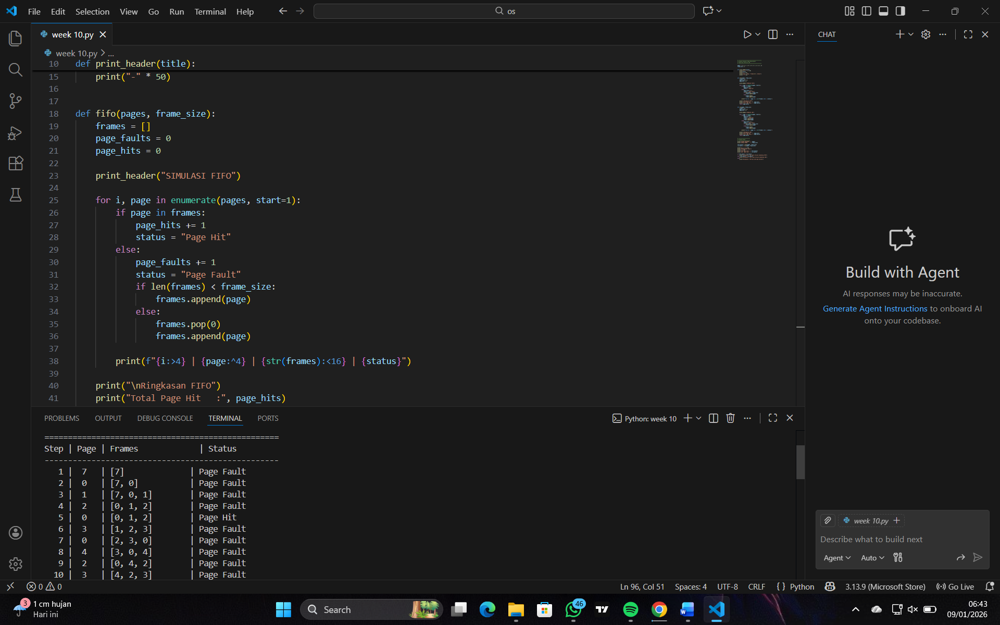

# Laporan Praktikum Minggu 10
Topik: Manajemen Memori – Page Replacement (FIFO & LRU)

---

## Identitas
- **Nama**  : Andi pratama  
- **NIM**   : 250202975  
- **Kelas** : 1 IKRA

---

## Tujuan
1. Mengimplementasikan algoritma page replacement FIFO dalam program.
2. Mengimplementasikan algoritma page replacement LRU dalam program.
3. Menjalankan simulasi page replacement dengan dataset tertentu.
4. Membandingkan performa FIFO dan LRU berdasarkan jumlah *page fault*.
5. Menyajikan hasil simulasi dalam laporan yang sistematis.

---

## Dasar Teori
1. Manajemen Memori
Manajemen memori adalah bagian dari sistem operasi yang bertugas mengatur penggunaan memori utama agar dapat digunakan secara efisien oleh banyak proses.
2. Konsep Page Replacement
Page replacement adalah proses pemilihan halaman di memori utama yang akan dikeluarkan ketika terjadi page fault dan tidak tersedia frame kosong. Tujuan utama page replacement adalah meminimalkan jumlah page fault dan meningkatkan kinerja sistem.
3. Algoritma FIFO (First In First Out)
FIFO merupakan algoritma page replacement paling sederhana. Algoritma ini menggantikan halaman yang paling awal masuk ke memori, tanpa memperhatikan seberapa sering atau seberapa baru halaman tersebut digunakan.
4. Algoritma LRU (Least Recently Used)
LRU menggantikan halaman yang paling lama tidak digunakan berdasarkan asumsi bahwa halaman yang baru digunakan kemungkinan akan digunakan kembali. Algoritma ini lebih optimal dibanding FIFO karena mempertimbangkan pola penggunaan halaman.

---

## Langkah Praktikum

   Gunakan *reference string* berikut sebagai contoh:
   ```
   7, 0, 1, 2, 0, 3, 0, 4, 2, 3, 0, 3, 2
   ```
   Jumlah frame memori: **3 frame**.

2. **Implementasi FIFO**

   - Simulasikan penggantian halaman menggunakan algoritma FIFO.
   - Catat setiap *page hit* dan *page fault*.
   - Hitung total *page fault*.

3. **Implementasi LRU**

   - Simulasikan penggantian halaman menggunakan algoritma LRU.
   - Catat setiap *page hit* dan *page fault*.
   - Hitung total *page fault*.

4. **Eksekusi & Validasi**

   - Jalankan program untuk FIFO dan LRU.
   - Pastikan hasil simulasi logis dan konsisten.
   - Simpan screenshot hasil eksekusi.

5. **Analisis Perbandingan**

   Buat tabel perbandingan seperti berikut:

   | Algoritma | Jumlah Page Fault | Keterangan |
   |:--|:--:|:--|
   | FIFO | ... | ... |
   | LRU | ... | ... |


   - Jelaskan mengapa jumlah *page fault* bisa berbeda.
   - Analisis algoritma mana yang lebih efisien dan alasannya.

6. **Commit & Push**
  commit
   ```bash
   git add .
   git commit -m "Minggu 10 - Page Replacement FIFO & LRU"
   git push origin main
   ```

---

## Kode / Perintah
pages = [7, 0, 1, 2, 0, 3, 0, 4, 2, 3, 0, 3, 2]
frame_size = 3


def print_header(title):
    print("\n" + "=" * 50)
    print(title)
    print("=" * 50)
    print("Step | Page | Frames\t\t | Status")
    print("-" * 50)


def fifo(pages, frame_size):
    frames = []
    page_faults = 0
    page_hits = 0

    print_header("SIMULASI FIFO")

    for i, page in enumerate(pages, start=1):
        if page in frames:
            page_hits += 1
            status = "Page Hit"
        else:
            page_faults += 1
            status = "Page Fault"
            if len(frames) < frame_size:
                frames.append(page)
            else:
                frames.pop(0)
                frames.append(page)

        print(f"{i:>4} | {page:^4} | {str(frames):<16} | {status}")

    print("\nRingkasan FIFO")
    print("Total Page Hit   :", page_hits)
    print("Total Page Fault :", page_faults)
    return page_faults


def lru(pages, frame_size):
    frames = []
    page_faults = 0
    page_hits = 0

    print_header("SIMULASI LRU")

    for i, page in enumerate(pages, start=1):
        if page in frames:
            page_hits += 1
            status = "Page Hit"
            frames.remove(page)
            frames.append(page)
        else:
            page_faults += 1
            status = "Page Fault"
            if len(frames) < frame_size:
                frames.append(page)
            else:
                frames.pop(0)
                frames.append(page)

        print(f"{i:>4} | {page:^4} | {str(frames):<16} | {status}")

    print("\nRingkasan LRU")
    print("Total Page Hit   :", page_hits)
    print("Total Page Fault :", page_faults)
    return page_faults

---


## Hasil Eksekusi
Sertakan screenshot hasil percobaan atau diagram:



# TABEL FIFO

| Step | Page | Frame 1 | Frame 2 | Frame 3 | Status |
| ---: | ---- | ------- | ------- | ------- | ------ |
|    1 | 7    | 7       | -       | -       | Fault  |
|    2 | 0    | 7       | 0       | -       | Fault  |
|    3 | 1    | 7       | 0       | 1       | Fault  |
|    4 | 2    | 2       | 0       | 1       | Fault  |
|    5 | 0    | 2       | 0       | 1       | Hit    |
|    6 | 3    | 2       | 3       | 1       | Fault  |
|    7 | 0    | 2       | 3       | 0       | Fault  |
|    8 | 4    | 4       | 3       | 0       | Fault  |
|    9 | 2    | 4       | 2       | 0       | Fault  |
|   10 | 3    | 4       | 2       | 3       | Fault  |
|   11 | 0    | 0       | 2       | 3       | Fault  |
|   12 | 3    | 0       | 2       | 3       | Hit    |
|   13 | 2    | 0       | 2       | 3       | Hit    |

# TABEL LRU

| Step | Page | Frame 1 | Frame 2 | Frame 3 | Status |
| ---: | ---- | ------- | ------- | ------- | ------ |
|    1 | 7    | 7       | -       | -       | Fault  |
|    2 | 0    | 7       | 0       | -       | Fault  |
|    3 | 1    | 7       | 0       | 1       | Fault  |
|    4 | 2    | 2       | 0       | 1       | Fault  |
|    5 | 0    | 2       | 0       | 1       | Hit    |
|    6 | 3    | 2       | 0       | 3       | Fault  |
|    7 | 0    | 2       | 0       | 3       | Hit    |
|    8 | 4    | 4       | 0       | 3       | Fault  |
|    9 | 2    | 4       | 0       | 2       | Fault  |
|   10 | 3    | 4       | 3       | 2       | Fault  |
|   11 | 0    | 0       | 3       | 2       | Fault  |
|   12 | 3    | 0       | 3       | 2       | Hit    |
|   13 | 2    | 0       | 3       | 2       | Hit    |


---

## Analisis
Berdasarkan hasil simulasi, algoritma FIFO mengganti halaman tanpa mempertimbangkan pola penggunaan sehingga menghasilkan page fault lebih banyak (10). Sementara itu, algoritma LRU memperhatikan halaman yang paling lama tidak digunakan sehingga lebih efisien dengan page fault lebih sedikit (9). Hal ini menunjukkan bahwa LRU lebih efektif dalam pengelolaan memori, meskipun implementasinya lebih kompleks dibanding FIFO.  

---

## Kesimpulan
1. Algoritma FIFO (First In First Out) bekerja dengan mengganti halaman yang pertama kali masuk ke memori tanpa memperhatikan frekuensi atau waktu terakhir penggunaan, sehingga menghasilkan 10 page fault.

2. Algoritma LRU (Least Recently Used) mengganti halaman yang paling lama tidak digunakan, sehingga lebih sesuai dengan pola akses memori dan menghasilkan 9 page fault.

3. Perbandingan hasil menunjukkan bahwa LRU lebih efisien dibanding FIFO karena mampu mengurangi jumlah kesalahan halaman.

4. Dengan demikian, algoritma LRU lebih direkomendasikan untuk sistem yang membutuhkan efisiensi pengelolaan memori, meskipun implementasinya lebih kompleks dibanding FIFO.

---

## Quiz
1. Apa perbedaan utama FIFO dan LRU?
   **Jawaban: FIFO lebih sederhana tetapi kurang efisien, sedangkan LRU lebih efisien dalam mengurangi page fault karena menyesuaikan dengan pola penggunaan memori.**  
2. Mengapa FIFO dapat menghasilkan Belady's Anomaly ?
   **Jawaban:FIFO hanya bergantung pada urutan masuk halaman, bukan pada kebutuhan aktual sistem, sehingga dapat bersifat tidak optimal dan menimbulkan Belady’s Anomaly.**  
3.Mengapa LRU umumnya menghasilkan kinerja lebih baik dibandingkan FIFO?
   **Jawaban:RU umumnya menghasilkan kinerja lebih baik dibandingkan FIFO karena algoritma ini mempertimbangkan pola akses memori (locality of reference).**  

---

## Refleksi Diri
Tuliskan secara singkat:
- Apa bagian yang paling menantang minggu ini?
  tugas yang banyak  
- Bagaimana cara Anda mengatasinya?
  kerjakan tugasnya

---

**Credit:**  
_Template laporan praktikum Sistem Operasi (SO-202501) – Universitas Putra Bangsa_
