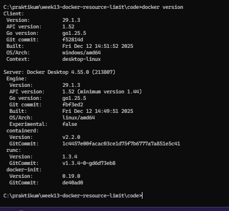
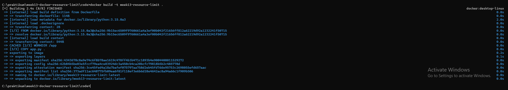
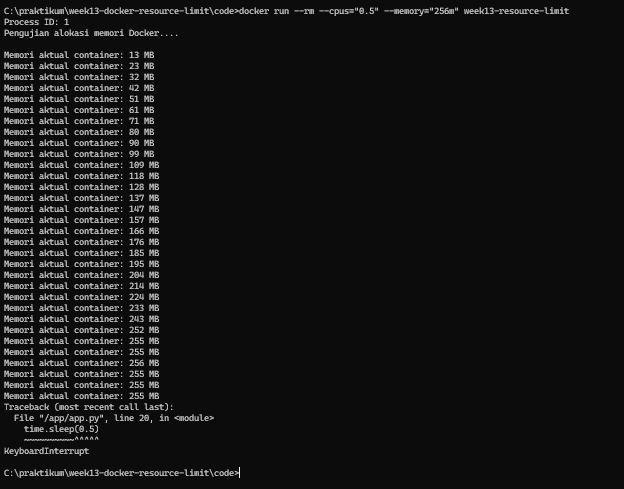
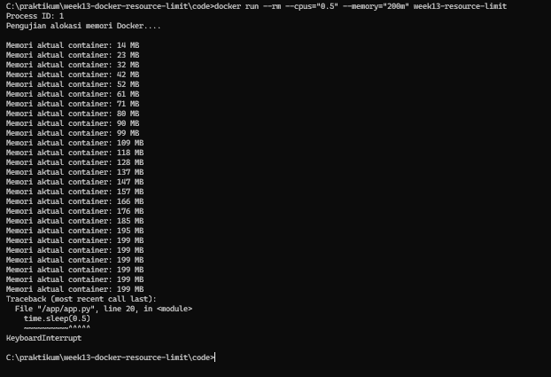
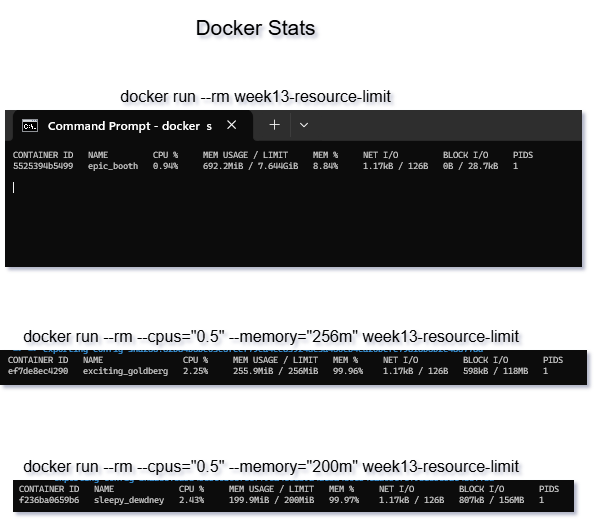

# Laporan Praktikum Minggu 13
Topik: Docker – Resource Limit (CPU & Memori)
---

## Identitas
- **Nama**  : Andi Pratama  
- **NIM**   : 250202975  
- **Kelas** : IKRA

---

## Tujuan
1. Mahasiswa mampu menulis Dockerfile sederhana untuk sebuah aplikasi/skrip.
2.  Mahasiswa mampu membangun image dan menjalankan container.
3. Mahasiswa mampu menjalankan container dengan pembatasan **CPU** dan **memori**.
4. Mahasiswa mampu mengamati dan menjelaskan perbedaan eksekusi container dengan dan tanpa limit resource.
5. Mahasiswa mampu menyusun laporan praktikum secara runtut dan sistematis.

---

## Dasar Teori
Docker adalah teknologi containerization yang menjalankan aplikasi dalam lingkungan terisolasi dengan memanfaatkan fitur kernel Linux seperti namespaces. Mekanisme ini membuat proses di dalam container terpisah secara logis dari sistem host dan container lainnya, meskipun masih menggunakan kernel yang sama.

Pembatasan penggunaan resource pada Docker dilakukan menggunakan Control Groups (cgroups). Cgroups memungkinkan sistem operasi mengatur dan membatasi pemakaian resource seperti CPU dan memori oleh container, sehingga setiap container hanya menggunakan resource sesuai batas yang ditentukan.

Pembatasan CPU mengatur porsi waktu CPU yang dapat digunakan oleh container, sehingga eksekusi progr
---

## Langkah Praktikum
1. Langkah-langkah yang dilakukan.
    
1.) **Persiapan Lingkungan**

   - Pastikan Docker terpasang dan berjalan.
   - Verifikasi:
     ```bash
     docker version
     docker ps
     ```

2.) **Membuat Aplikasi/Skrip Uji**

   Program sederhana di folder `code/` (bahasa Python) yang:
   - Melakukan komputasi berulang (untuk mengamati limit CPU), dan/atau
   - Mengalokasikan memori bertahap (untuk mengamati limit memori).

3.) **Membuat Dockerfile**

   - Tulis `Dockerfile` untuk menjalankan program uji.
   - Build image:
     ```bash
     docker build -t week13-resource-limit .
     ```

4.) **Menjalankan Container Tanpa Limit**

   - Jalankan container normal:
     ```bash
     docker run --rm week13-resource-limit
     ```
   - Catat output/hasil pengamatan.

5.) **Menjalankan Container Dengan Limit Resource**

   Jalankan container dengan batasan resource (contoh):
   ```bash
   docker run --rm --cpus="0.5" --memory="256m" week13-resource-limit
   ```
   Catat perubahan perilaku program (mis. lebih lambat, error saat memori tidak cukup, dll.).

6.) **Monitoring Sederhana**

   - Jalankan container (tanpa `--rm` jika perlu) dan amati penggunaan resource:
     ```bash
     docker stats
     ```
   - Ambil screenshot output eksekusi dan/atau `docker stats`. 

7.)  Melakukan commit ketika sudah selesai.

2. Perintah yang dijalankan. 

```bash
import os
import time

print(f"Process ID: {os.getpid()}")
print("Pengujian alokasi memori Docker.... \n", flush=True)

buffer = []

def get_real_memory_mb():
    try:
        with open("/sys/fs/cgroup/memory.current", "r") as f:
            return int(f.read()) // (1024 * 1024)
    except:
        return -1

while True:
    buffer.append("M" * 10_000_000)  # ±10 MB
    real_mb = get_real_memory_mb()
    print(f"Memori aktual container: {real_mb} MB", flush=True)
    time.sleep(0.5)
```
3. File dan kode yang dibuat.  
laporan.md, Dockerfile, app.py, hasil_limit.png, hasil_tidak_limit.png, Docker_version.png, Docker_ps.png, Build_image.png, hasil_limit_200m.png, Docker_Stats.png
4. Commit message yang digunakan. -> ** Minggu 13 - Docker Resource Limit **
---

## Kode / Perintah
Potongan kode atau perintah utama:

Dockerfile:
```bash
FROM python:3.15.0a3
WORKDIR /app
COPY app.py .
CMD ["python", "app.py"]
```

app.py :
```bash
import os
import time

print(f"Process ID: {os.getpid()}")
print("Pengujian alokasi memori Docker.... \n", flush=True)

buffer = []

def get_real_memory_mb():
    try:
        with open("/sys/fs/cgroup/memory.current", "r") as f:
            return int(f.read()) // (1024 * 1024)
    except:
        return -1

while True:
    buffer.append("M" * 10_000_000)  # ±10 MB
    real_mb = get_real_memory_mb()
    print(f"Memori aktual container: {real_mb} MB", flush=True)
    time.sleep(0.5)
```

---

## Hasil Eksekusi
Sertakan screenshot hasil percobaan atau diagram:






---

## Analisis
- **Tabel Hasil Pengamatan Pengujian Penggunaan Memori Container Docker**

| No | Aspek yang Diamati      | Hasil Pengamatan                             |
| -- | ----------------------- | -------------------------------------------- |
| 1  | Status awal container   | Container berhasil dijalankan tanpa kendala  |
| 2  | Penggunaan memori awal  | 13 MB                                |
| 3  | Pola penggunaan memori  | Mengalami peningkatan secara bertahap        |
| 4  | Kondisi operasional     | Container tetap berjalan stabil              |
| 5  | Penghentian pengujian   | Proses dihentikan secara paksa oleh pengguna |
| 6  | Penggunaan memori akhir | 692 MB                               |
| 7  | Kesalahan sistem        | Tidak ditemukan kesalahan selama pengujian   |

Menjalankan container tanpa limit sumber daya berarti container tidak diberikan batasan penggunaan memori oleh Docker. Akibatnya, container dapat menggunakan memori sistem secara bebas sesuai kebutuhan proses yang berjalan di dalamnya. Pada pengujian ini, penggunaan memori meningkat secara bertahap selama container dijalankan dan tidak terjadi penghentian otomatis oleh sistem. Pengujian dihentikan secara paksa oleh pengguna, sehingga penggunaan memori akhir bukan merupakan batas maksimum container. Kondisi ini menunjukkan bahwa tanpa pengaturan limit, container berpotensi mengonsumsi sumber daya sistem dalam jumlah besar.

- **Tabel Hasil Pengamatan Pengujian Container dengan Batasan Resource**

| No | Aspek yang Diamati     | Hasil Pengamatan                                                   |
| -- | ---------------------- | ------------------------------------------------------------------ |
| 1  | Konfigurasi resource   | CPU dibatasi sebesar 0,5 core dan memori dibatasi                  |
| 2  | Penggunaan memori awal | Penggunaan memori meningkat secara bertahap                        |
| 3  | Batas memori 256 MB (Simulasi 1)   | Penggunaan memori berhenti pada kisaran ±255 MB                    |
| 4  | Batas memori 200 MB (Simulasi 2)   | Penggunaan memori berhenti pada kisaran ±199 MB                    |
| 5  | Perilaku program       | Program tidak dapat menambah alokasi memori setelah mencapai batas |
| 6  | Kondisi container      | Container tetap berjalan stabil tanpa mengalami crash              |
| 7  | Error sistem           | Tidak ditemukan error Out of Memory                                |
| 8  | Penghentian pengujian  | Proses dihentikan secara manual oleh pengguna                      |

Pada pengujian ini, saya melakukan dua simulasi Menjalankan Container Dengan Limit Resource dengan penerapan batasan (limit) resource pada container Docker. Simulasi pertama menggunakan batas memori sebesar 256 MB, sedangkan simulasi kedua menggunakan batas memori sebesar 200 MB, dengan pembatasan CPU sebesar 0,5 core pada kedua skenario. Hasil pengujian menunjukkan bahwa penggunaan memori pada masing-masing simulasi meningkat hingga mendekati nilai batas yang ditetapkan, kemudian tidak dapat bertambah lebih lanjut. Hal ini membuktikan bahwa mekanisme pembatasan resource pada Docker berjalan sesuai dengan konfigurasi yang diterapkan.


- **Tabel Hasil Pengamatan Monitoring Resource Menggunakan docker stats**

| No | Skenario Pengujian            | CPU Usage | Memori  | Persentase Memori | Keterangan                            |
| -- | ----------------------------- | --------- | ---------------------- | ----------------- | ------------------------------------- |
| 1  | Container tanpa limit         | ±0,94%    | 692,2 MB / 7,64 GB     | ±8,84%            | Memori dapat digunakan secara bebas   |
| 2  | Container dengan limit 256 MB | ±2,25%    | 255,9 MB / 256 MB      | ±99,96%           | Memori mencapai batas yang ditetapkan |
| 3  | Container dengan limit 200 MB | ±2,43%    | 199,9 MB / 200 MB      | ±99,97%           | Memori mencapai batas yang ditetapkan |

Monitoring menggunakan perintah docker stats menunjukkan adanya perbedaan antara container tanpa batasan resource dan cont 

---

## Kesimpulan
Berdasarkan hasil praktikum, penggunaan resource pada container Docker dapat dikendalikan dengan baik melalui pengaturan batas CPU dan memori. Container yang dijalankan tanpa limit cenderung menggunakan memori secara bebas, sedangkan container dengan limit hanya menggunakan resource sesuai batas yang ditentukan.

Penerapan batas memori(limit) menunjukkan bahwa Docker mampu membatasi alokasi memori tanpa menyebabkan container berhenti secara tiba-tiba. Hal ini membantu menjaga kestabilan sistem ketika menjalankan aplikasi yang berpotensi menggunakan memori dalam jumlah besar.

Pemantauan menggunakan perintah docker stats memudahkan pengamatan penggunaan resource secara langsung dan membantu memahami perbedaan perilaku container dengan dan tanpa pembatasan resource.

---

## Quiz
1. Mengapa container perlu dibatasi CPU dan memori?

Container perlu dibatasi CPU dan memori agar satu container tidak menggunakan sumber daya secara berlebihan dan mengganggu container lain maupun sistem host. Pembatasan ini membantu menjaga stabilitas sistem, memastikan pembagian resource yang adil, serta mencegah terjadinya overload yang dapat menyebabkan penurunan performa atau crash.

2. Apa perbedaan VM dan container dalam konteks isolasi sumber daya?

Virtual Machine (VM) menyediakan isolasi yang kuat karena setiap VM memiliki sistem operasi sendiri dan sumber daya yang dialokasikan secara terpisah oleh hypervisor. Sebaliknya, container berbagi kernel sistem operasi host, sehingga isolasinya lebih ringan dan efisien, tetapi tidak sekuat VM dalam hal pemisahan lingkungan sistem.

3. Apa dampak limit memori terhadap aplikasi yang boros memori?

Pembatasan memori pada aplikasi yang boros memori dapat menyebabkan penurunan kinerja, aplikasi menjadi lambat, atau berhenti berjalan jika batas memori terlampaui. Dalam beberapa kasus, sistem akan menghentikan proses (out-of-memory kill) untuk menjaga kestabilan sistem secara keseluruhan.

---

## Refleksi Diri
Tuliskan secara singkat:
- Apa bagian yang paling menantang minggu ini?  
- Bagaimana cara Anda mengatasinya?  

---

**Credit:**  
_Template laporan praktikum Sistem Operasi (SO-202501) – Universitas Putra Bangsa_
