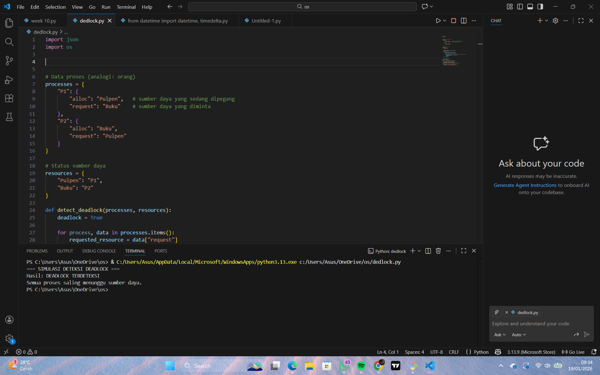

# Laporan Praktikum Minggu 14
Topik: Deteksi Kebuntuan

---

## Identitas
- **Nama**  : Andi pratama  
- **NIM**   : 250202975  
- **Kelas** : IKRA

---

# 1. Pendahuluan (Introduction)

## 1.1 Latar Belakang

  Perkembangan sistem komputer modern menuntut kemampuan pengelolaan sumber daya yang semakin kompleks, khususnya pada sistem operasi yang mendukung eksekusi banyak proses secara bersamaan. Dalam lingkungan multiprogramming dan multitasking, berbagai proses harus berbagi sumber daya terbatas seperti memori, perangkat input/output, dan prosesor. Kondisi ini, jika tidak dikelola dengan baik, dapat menimbulkan permasalahan serius yang dikenal sebagai kebuntuan (deadlock).

  Deadlock merupakan keadaan ketika dua atau lebih proses saling menunggu pelepasan sumber daya yang sedang dipegang oleh proses lain, sehingga tidak ada satu pun proses yang dapat melanjutkan eksekusinya. Kondisi kebuntuan ini menyebabkan sistem menjadi tidak responsif, menurunkan kinerja, serta berpotensi mengakibatkan kegagalan layanan. Oleh karena itu, deadlock menjadi salah satu permasalahan penting yang harus diperhatikan dalam perancangan dan pengelolaan sistem operasi.

---
## 1.2 Rumusan Masalah

Berdasarkan latar belakang tersebut, rumusan masalah dalam praktikum ini adalah:
1. Apa yang dimaksud dengan kebuntuan (deadlock) dalam sistem operasi dan bagaimana kondisi tersebut dapat terjadi dalam pengelolaan sumber daya?
2. Bagaimana mekanisme dan algoritma deteksi kebuntuan diterapkan dalam sistem operasi untuk mengidentifikasi proses-proses yang mengalami kebuntuan?
3. Apa dampak terjadinya kebuntuan terhadap kinerja dan stabilitas sistem serta bagaimana langkah pemulihan yang dapat dilakukan setelah kebuntuan terdeteksi?

---

## 1.3 Tujuan

Tujuan dari pelaksanaan praktikum ini adalah:
1. Mengimplementasikan algoritma page replacement FIFO dan LRU.
2. Melakukan simulasi penggantian halaman menggunakan reference string tertentu.
3. Membandingkan kinerja algoritma FIFO dan LRU berdasarkan jumlah *page fault*.
4. Menganalisis kelebihan dan kekurangan masing-masing algoritma.

---

# 2. Metode (Methods)

## 2.1 Lingkungan Pengujian

Pengujian dilakukan dengan lingkungan sebagai berikut:
- Sistem Operasi: Windows  
- Metode Pengujian: Model simulasi menggambarkan proses sebagai individu (orang) dan sumber daya sebagai alat kerja yang digunakan bersama.
- Bahasa Pemograman: python

Lingkungan pengujian dibuat seragam untuk memastikan hasil yang diperoleh bersifat objektif dan dapat dibandingkan.

---
## 2.2 Skenario Pengujian

Skenario 1: Kondisi Deadlock
Pada skenario ini, sistem disusun dalam kondisi saling menunggu antarproses.
Orang A memegang sumber daya Pulpen dan meminta Buku.
Orang B memegang sumber daya Buku dan meminta Pulpen.
Tidak ada sumber daya yang bebas untuk dialokasikan.
Hasil yang diharapkan:
Sistem berada dalam kondisi deadlock karena terbentuknya siklus ketergantungan antara proses dan sumber daya.

Skenario 2: Kondisi Tidak Terjadi Deadlock
Pada skenario ini, salah satu proses tidak memegang sumber daya saat mengajukan permintaan.
Orang A memegang Pulpen dan meminta Buku.
Buku dalam keadaan bebas (tidak dipegang oleh proses lain).
Orang B tidak memegang sumber daya apa pun.
Hasil yang diharapkan:
Tidak terjadi kebuntuan karena permintaan sumber daya dapat terpenuhi dan proses dapat melanjutkan eksekusi.

Skenario 3: Pencegahan Deadlock melalui Pelepasan Sumber Daya
Pada skenario ini, salah satu proses melepaskan sumber daya yang dipegang.
Orang A melepaskan Pulpen sebelum meminta Buku.
Orang B memegang Buku dan tidak meminta sumber daya lain.
Sumber daya Pulpen menjadi tersedia.
Hasil yang diharapkan:
Deadlock dapat dihindari karena tidak terjadi kondisi saling menunggu antarproses.

---
## 2.3 Variabel Pengukuran

Variabel yang digunakan dalam praktikum ini meliputi:
- **Variabel bebas:** pola alokasi dan permintaan sumber daya oleh proses .
- **Variabel terikat:** kondisi sistem.
- **Variabel kontrol:** Jumlah proses yang digunakan dalam simulasi,Jumlah dan jenis sumber daya yang tersedia,Aturannya adalah sumber daya tidak dapat dibagikan secara bersamaan

Variabel ini dijaga tetap konstan agar hasil pengamatan hanya dipengaruhi oleh variabel bebas.

---

## 2.4 Langkah Eksperimen
Langkah eksperimen dilakukan secara berurutan sebagai berikut:
1.Mendefinisikan sejumlah proses yang merepresentasikan individu dalam kehidupan sehari-hari.
2.Menentukan sumber daya terbatas yang digunakan bersama oleh proses-proses tersebut.
3.Pengaturan kondisi awal di mana setiap proses memegang satu sumber daya dan meminta sumber daya lain.
4.Batasan simulasi untuk memeriksa apakah permintaan sumber daya dapat terpenuhi.
5.Mengidentifikasi kondisi saling menunggu antarproses yang menyebabkan tidak ada proses dapat melanjutkan aktivitasnya.
6.Menyimpulkan terjadinya deadlock apabila seluruh proses berada dalam keadaan menunggu tanpa adanya pelepasan sumber daya.

---

## 2.5  Parameter/datatest

| Parameter          | Deskripsi                                   |
| ------------------ | ------------------------------------------- |
| Jumlah proses      | 2 proses (Orang A dan Orang B)              |
| Jumlah sumber daya | 2 sumber daya (Pulpen dan Buku)             |
| Status alokasi     | Setiap proses memegang satu sumber daya     |
| Status permintaan  | Setiap proses meminta satu sumber daya lain |
| Model hubungan     | One-to-one (satu proses – satu sumber daya) |

# 3. Hasil (Results)

## 3.1  Hasil Eksekusi Program

Kode program ini digunakan untuk mensimulasikan dan mendeteksi kondisi deadlock dengan pendekatan sederhana. Setiap proses direpresentasikan sebagai sebuah entitas yang memegang satu sumber daya (alloc) dan meminta sumber daya lain (request). Status kepemilikan sumber daya disimpan dalam struktur data resources.

Fungsi detect_deadlock() bekerja dengan memeriksa apakah seluruh proses hanya berada dalam kondisi menunggu tanpa adanya sumber daya yang bebas. Jika semua sumber daya yang diminta sedang dipegang oleh proses lain, maka sistem dinyatakan mengalami deadlock. Hasil deteksi kemudian ditampilkan dalam bentuk pesan yang menunjukkan apakah terjadi kebuntuan atau tidak.

---

Hasil (Results)
1. Tabel Hasil Pengujian

Berdasarkan skenario pengujian yang telah dilakukan, diperoleh hasil sebagai berikut:

| No | Skenario Pengujian                  | Kondisi Sistem                         | Deadlock Terdeteksi | Keterangan                        |
| -- | ----------------------------------- | -------------------------------------- | ------------------- | --------------------------------- |
| 1  | Skenario Deadlock (saling menunggu) | Semua proses menunggu sumber daya lain | Ya                  | Terbentuk siklus ketergantungan   |
| 2  | Skenario Tidak Deadlock             | Terdapat sumber daya bebas             | Tidak               | Proses dapat melanjutkan eksekusi |
| 3  | Skenario Pelepasan Sumber Daya      | Salah satu proses melepas sumber daya  | Tidak               | Kebuntuan berhasil dihindari      |

Hasil pengujian menunjukkan bahwa deadlock terjadi ketika seluruh proses memegang satu sumber daya dan secara bersamaan meminta sumber daya lain yang tidak tersedia. Pada kondisi ini, tidak ada proses yang dapat melanjutkan eksekusi, sehingga sistem berada dalam keadaan kebuntuan.

Sebaliknya, pada skenario di mana terdapat sumber daya yang masih bebas atau salah satu proses bersedia melepaskan sumber daya yang sedang dipegang, deadlock tidak terjadi. Hal ini membuktikan bahwa keberadaan sumber daya bebas atau mekanisme pelepasan sumber daya sangat berpengaruh dalam mencegah kebuntuan.

---

3. Ringkasan Temua

Berdasarkan hasil praktikum, dapat dirangkum beberapa temuan utama sebagai berikut:
a. Dealock terjadi akibat adanya kondisi saling menunggu antarproses menuju sumber daya yang terbatas.
b. Siklus ketergantungan merupakan indikator utama dalam pendeteksian kebuntuan.
c. Deadlock dapat dihindari jika sistem memiliki sumber daya bebas atau menerapkan kebijakan pelepasan sumber daya oleh proses tertentu.

---

## 3.2 Tabel Perbandingan Hasil

| No | Skenario       | Kondisi Alokasi Sumber Daya          | Kondisi Permintaan                 | Hasil Deteksi  | Penjelasan                                                      |
| -- | -------------- | ------------------------------------ | ---------------------------------- | -------------- | --------------------------------------------------------------- |
| 1  | Deadlock       | P1 memegang Pulpen, P2 memegang Buku | P1 meminta Buku, P2 meminta Pulpen | Deadlock       | Terjadi saling menunggu karena tidak ada sumber daya yang bebas |
| 2  | Tidak Deadlock | P1 memegang Pulpen, Buku bebas       | P1 meminta Buku                    | Tidak Deadlock | Permintaan dapat dipenuhi sehingga proses dapat berjalan        |
| 3  | Pencegahan     | P1 melepas Pulpen                    | P2 memegang Buku                   | Tidak Deadlock | Pelepasan sumber daya memutus siklus ketergantungan             |
Berdasarkan tabel perbandingan hasil di atas, dapat disimpulkan bahwa kondisi deadlock hanya terjadi pada skenario pertama, yaitu ketika setiap proses memegang satu sumber daya dan secara bersamaan meminta sumber daya lain yang sedang dipegang oleh proses lain. Kondisi ini menyebabkan terbentuknya siklus ketergantungan sehingga tidak ada proses yang dapat melanjutkan eksekusi.

Pada skenario kedua dan ketiga, deadlock tidak terjadi karena terdapat sumber daya yang masih bebas atau adanya pelepasan sumber daya oleh salah satu proses. Hal ini menunjukkan bahwa ketersediaan sumber daya dan kebijakan pelepasan sumber daya memiliki peran penting dalam mencegah terjadinya deadlock. Dengan demikian, hasil praktikum menegaskan bahwa deadlock dapat dihindari apabila sistem tidak memenuhi kondisi saling menunggu secara bersamaan.

---

# 4. Pembahasan (Discussion)

  Berdasarkan tabel perbandingan hasil di atas, dapat disimpulkan bahwa kondisi deadlock hanya terjadi pada skenario pertama, yaitu ketika setiap proses memegang satu sumber daya dan secara bersamaan meminta sumber daya lain yang sedang dipegang oleh proses lain. Kondisi ini menyebabkan terbentuknya siklus ketergantungan sehingga tidak ada proses yang dapat melanjutkan eksekusi.

  Pada skenario kedua dan ketiga, deadlock tidak terjadi karena terdapat sumber daya yang masih bebas atau adanya pelepasan sumber daya oleh salah satu proses. Hal ini menunjukkan bahwa ketersediaan sumber daya dan kebijakan pelepasan sumber daya memiliki peran penting dalam mencegah terjadinya deadlock. Dengan demikian, hasil praktikum menegaskan bahwa deadlock dapat dihindari apabila sistem tidak memenuhi kondisi saling menunggu secara bersamaan.

---
## 4.1 Analisis
  Berdasarkan hasil praktikum, deadlock terjadi ketika seluruh proses saling menunggu sumber daya yang tidak tersedia. Kondisi ini ditandai dengan tidak adanya sumber daya bebas serta terbentuknya siklus ketergantungan antarproses. Simulasi yang dilakukan berhasil menunjukkan bahwa pola alokasi dan permintaan sumber daya sangat berpengaruh terhadap terjadinya deadlock.

  Pada skenario lain, deadlock tidak terjadi karena adanya sumber daya yang masih tersedia atau pelepasan sumber daya oleh salah satu proses. Hal ini membuktikan bahwa kebuntuan dapat dicegah dengan pengelolaan sumber daya yang tepat. Meskipun simulasi bersifat sederhana, praktikum ini efektif dalam membantu memahami konsep dasar deteksi deadlock dalam sistem operasi.

---

## 4.2  Kelebihan dan Kekurangan

Kelebihan
1. Praktikum menggunakan simulasi sederhana sehingga mudah dipahami oleh pemula.
2. Analogi kehidupan sehari-hari membantu memperjelas konsep deadlock dalam sistem operasi.
3. Kode program ringkas dan mudah dimodifikasi untuk berbagai skenario pengujian.
4. Praktikum efektif untuk menunjukkan hubungan antara proses, sumber daya, dan kondisi kebuntuan.

Kekurangan
1. Simulasi belum mencerminkan kondisi sistem operasi yang sesungguhnya karena tidak menggunakan proses paralel atau thread.
2. Algoritma deteksi yang digunakan masih sederhana dan belum menerapkan metode formal seperti graf alokasi sumber daya secara penuh.
3. Tidak mempertimbangkan aspek waktu eksekusi dan prioritas proses.
4. Jumlah proses dan sumber daya masih terbatas sehingga kasus deadlock yang lebih kompleks belum terwakili.

---

# 5. Closing (Penutupan)

## 5.1 Kesimpulan
  Berdasarkan hasil praktikum yang telah dilakukan, dapat disimpulkan bahwa kebuntuan (deadlock) terjadi akibat adanya kondisi saling menunggu antarproses terhadap sumber daya yang terbatas. Melalui simulasi sederhana, praktikum ini berhasil menunjukkan bagaimana pola alokasi dan permintaan sumber daya dapat menyebabkan atau mencegah terjadinya deadlock. Dengan demikian, praktikum ini membantu memahami konsep dasar deteksi deadlock dalam sistem operasi secara lebih konkret.

---

## 5.2 Saran
  Untuk pengembangan praktikum selanjutnya, disarankan agar simulasi diperluas dengan menambahkan jumlah proses dan sumber daya yang lebih banyak serta menerapkan algoritma deteksi deadlock yang lebih kompleks. Selain itu, penggunaan konsep eksekusi paralel dapat dipertimbangkan agar simulasi lebih mendekati kondisi sistem operasi yang sebenarnya.

---

## 5.3 Quiz

1. **Mengapa format IMRAD membantu membuat laporan praktikum lebih ilmiah dan mudah dievaluasi?** format IMRAD membantu laporan praktikum menjadi lebih ilmiah karena terstruktur, objektif, mudah dipahami, dan mudah dievaluasi oleh penguji.  
  

2. **Apa perbedaan antara bagian Hasil dan Pembahasan?**  Bagian hasil berisi temuan objektif yang diperoleh dari praktikum atau eksperimen. Pada bagian ini, penulis hanya menyajikan data apa adanya tanpa memberikan interpretasi atau pendapat pribadi. Data dapat ditampilkan dalam bentuk tabel, grafik, atau output program, disertai penjelasan singkat tentang apa yang terlihat. Tujuan utama bagian hasil adalah menunjukkan apa yang terjadi selama pengujian.
   

3. **Mengapa sitasi dan daftar pustaka penting, bahkan untuk laporan praktikum?**
a. Menunjukkan kejujuran akademik
b. Memperkuat keilmiahan laporan
c. Memudahkan verifikasi dan penilaian
d. Menghargai karya ilmiah orang lain
e. Melatih kebiasaan menulis ilmiah yang benar
  
---

## Daftar Pustaka

1.Silberschatz, A., Galvin, P. B., & Gagne, G. (2018).
Operating System Concepts (10th ed.). Hoboken, NJ: John Wiley & Sons.

2.Tanenbaum, A. S., & Bos, H. (2015).
Modern Operating Systems (4th ed.). Boston: Pearson Education.

3.Stallings, W. (2018).
Operating Systems: Internals and Design Principles (9th ed.). Boston: Pearson.

4.Day, R. A., & Gastel, B. (2012).
How to Write and Publish a Scientific Paper (7th ed.). Cambridge: Cambridge University Press.

---

**Credit:**  
_Template laporan praktikum Sistem Operasi (SO-202501) – Universitas Putra Bangsa_
